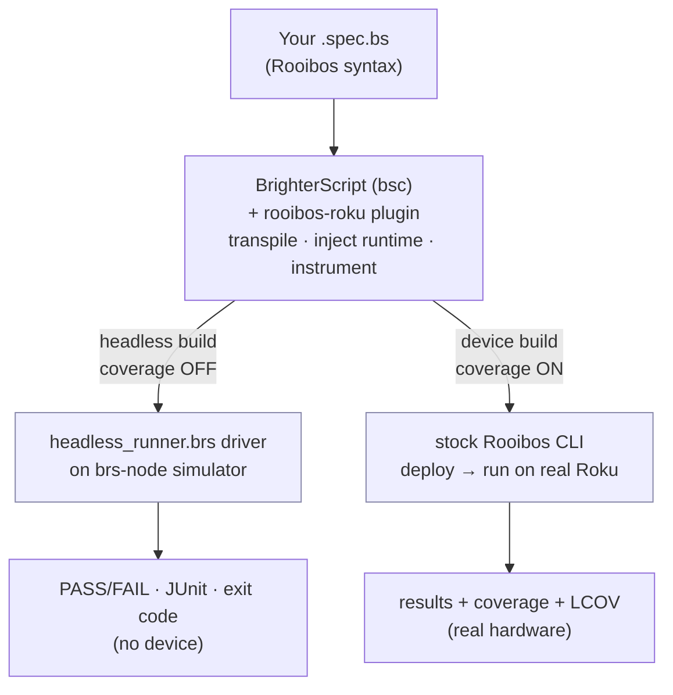
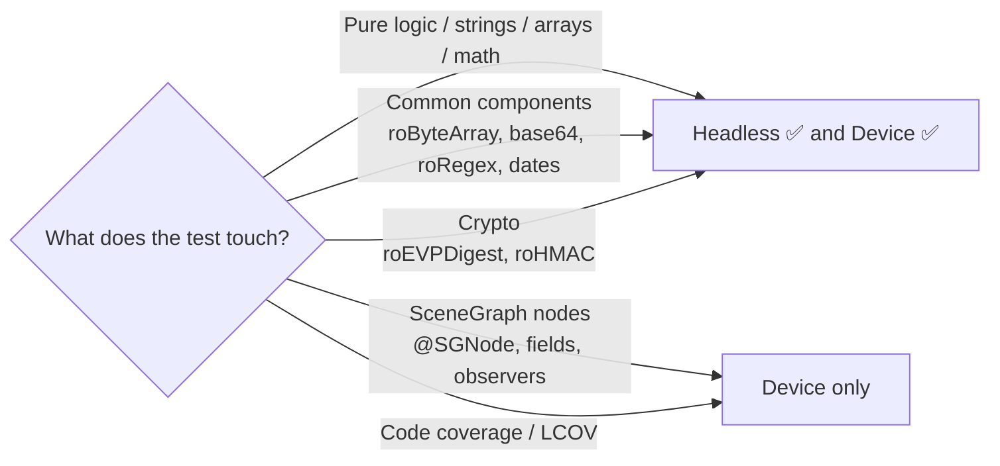

# Architecture

roku-test is a thin orchestration layer over three mature tools. You write Rooibos specs once; the tool
runs them in one of two lanes.

## Components

| Component | Role | Runtime? |
|---|---|---|
| **BrighterScript (`bsc`)** | Compiles/transpiles plain `.brs` + `.bs`; hosts the Rooibos plugin; builds/deploys. | No (compiler) |
| **rooibos-roku** (bsc plugin) | Turns `@suite/@it/@params` specs into runnable suites; injects the runtime + coverage instrumentation. | No (build-time) |
| **brs-node** (`brs-cli`) | BrightScript simulator that runs `.brs` headlessly in Node. Broad component set incl. crypto. | Yes (headless) |
| **roku-test** | The CLI/orchestrator: generates configs, builds, runs the right lane, parses results, writes JUnit/LCOV. | — |

## The two lanes

### Headless (default)

1. `bsc` builds with the Rooibos plugin but **coverage off** (a coverage-on build calls an on-device
   collector that doesn't exist headless).
2. A bundled driver (`brs/headless_runner.brs`) asks Rooibos's generated `RuntimeConfig` for the suite
   map, instantiates each suite (constructors are node-free), walks its `groupsData → testCases`, sets
   `m.currentResult`, invokes each test method (handling `@params`), and reads the pass/fail state —
   reusing **Rooibos's own assertions**.
3. Runs on **brs-node** (`brs-cli -n`, SceneGraph disabled). roku-test parses `PASS`/`FAIL`/`__RESULT__`
   lines, writes optional JUnit, and sets a CI exit code.

### Device (opt-in)

1. `bsc` builds with the Rooibos plugin and **coverage on**.
2. roku-test hands off to the **stock Rooibos CLI**, which deploys to the Roku and runs the scene-based
   runner on hardware.
3. Results and a **coverage report** come back over the network. With `--lcov`, roku-test scrapes the
   printed LCOV blocks and writes `lcov.info` locally.

## Why one spec works in both

A Rooibos suite compiles to a plain object: test methods plus a metadata structure
(`testGroups → testCases`, each with `funcName`, `name`, `rawParams`). Assertions set
`m.currentResult.isFail`. The scene-based runner is just *one* way to drive that object; the headless
driver is another. Same compiled suite, same assertions — only the driver differs.

## What runs where

Design guideline: keep business logic in pure functions so most tests stay in the fast headless lane;
reserve the device lane for genuinely UI-coupled behavior and coverage runs. More in
[Headless vs device](/writing-tests/headless-vs-device).
