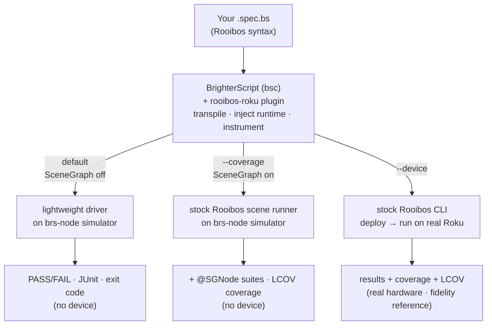
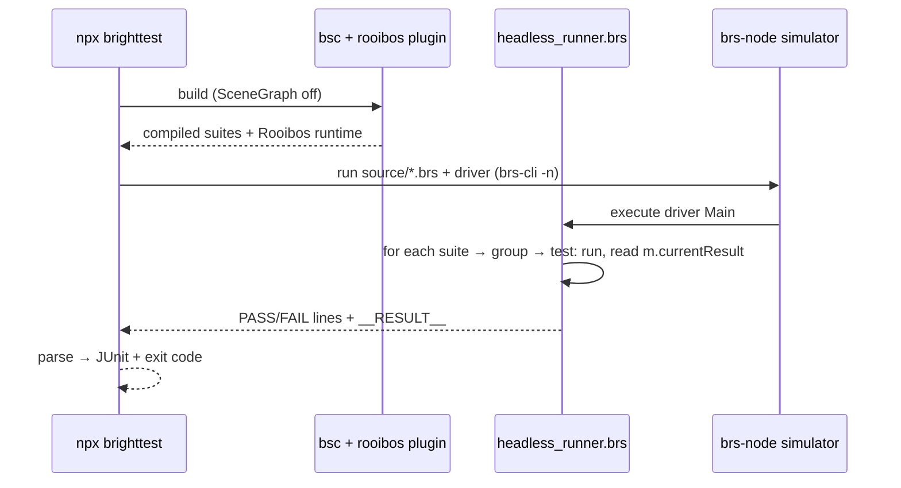
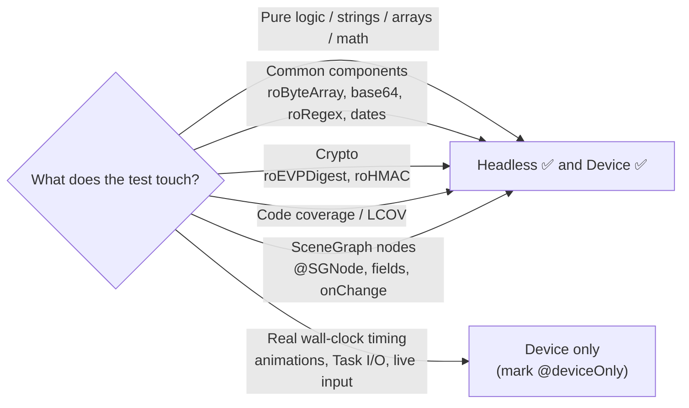

# Architecture

brighttest is a thin orchestration layer over three mature tools. You write Rooibos specs once; the tool
runs them headless (no device) or on a real Roku — and can diff the two to prove the fast lane is faithful.

`--cross-check` runs the headless and device lanes and diffs every test, so the fast lane can be trusted.

## Components

| Component | Role | Runtime? |
|---|---|---|
| **BrighterScript (`bsc`)** | Compiles/transpiles plain `.brs` + `.bs`; hosts the Rooibos plugin; builds/deploys. | No (compiler) |
| **rooibos-roku** (bsc plugin) | Turns `@suite/@it/@params` specs into runnable suites; injects the runtime + coverage instrumentation. | No (build-time) |
| **brs-node** (`brs-cli`) | BrightScript **and SceneGraph** simulator that runs `.brs` headlessly in Node. Broad component set incl. crypto, and a SceneGraph engine so `@SGNode` suites run without a device. | Yes (headless) |
| **brighttest** | The CLI/orchestrator: generates configs, builds, runs the right lane, parses results, writes JUnit/LCOV. | — |

## The lanes

### Headless — default (fast loop)

1. `bsc` builds with the Rooibos plugin, **SceneGraph off** — the fastest configuration.
2. A bundled driver (`brs/headless_runner.brs`) asks Rooibos's generated `RuntimeConfig` for the suite
   map, instantiates each suite, walks its `groupsData → testCases`, invokes each test method (handling
   `@params`), and reads the pass/fail state — reusing **Rooibos's own assertions**.
3. Runs on **brs-node** (`brs-cli -n`). brighttest parses `PASS`/`FAIL`/`__RESULT__` lines, writes optional
   JUnit, and sets a CI exit code. With a project that has `@SGNode` specs, the default lane boots a scene
   to run them too (pass `--no-sgnode` to skip that and stay on the pure SceneGraph-off driver).

### Headless coverage — `--coverage` (no device)

1. `bsc` builds with the Rooibos plugin and **coverage instrumentation + SceneGraph on**.
2. brighttest runs the **stock Rooibos scene runner on the brs-node simulator**. Because the simulator has
   a SceneGraph engine, this runs `@SGNode` node suites and their `onChange` observer cascades in full,
   and the coverage collector's field observers work — yielding **real LCOV with no device**.
3. brighttest scrapes the printed coverage blocks (ANSI-stripped) and writes `lcov.info`.

### Device — `--device` (the reference)

1. `bsc` builds with the Rooibos plugin and coverage on.
2. brighttest hands off to the **stock Rooibos CLI**, which deploys to the Roku and runs the scene-based
   runner on hardware. Results + coverage come back over the network; `--lcov` writes `lcov.info` locally.
3. The device lane is the fidelity reference — it runs everything, including behavior tied to real
   wall-clock timing that the simulator only approximates.

### Cross-check — `--cross-check`

Builds once, runs both the headless and device lanes, matches tests by name, and reports `agree` /
`device-only` / `DIVERGENT`. A run fails on any divergence, so the headless lane stays a trustworthy proxy.

## Why one spec works in every lane

A Rooibos suite compiles to a plain object: test methods plus a metadata structure
(`testGroups → testCases`, each with `funcName`, `name`, `rawParams`). Assertions set
`m.currentResult.isFail`. The scene-based runner is just *one* way to drive that object; the headless
driver is another. Same compiled suite, same assertions — only the driver and the run target differ.

## What runs where

Design guideline: keep business logic in pure functions so most tests are trivially headless; the few
tests that genuinely need real hardware timing get marked `@deviceOnly` and skipped on the fast lanes.
More in [Headless vs device](/writing-tests/headless-vs-device).
