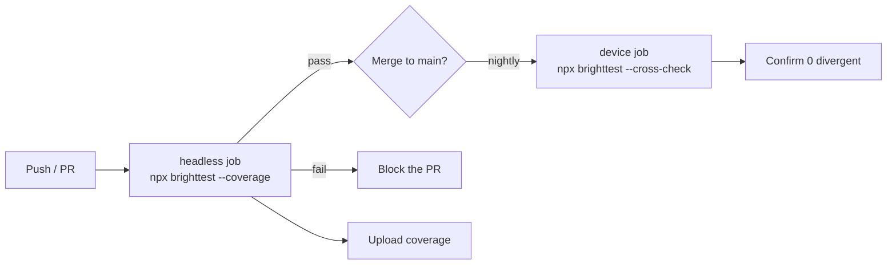

# CI integration

Run the **headless lane on every push** — it's a fast, hardware-free gate that also produces
**code coverage** (`--coverage`). Use the **device lane** occasionally (nightly / pre-release) as a
**fidelity check** via `--cross-check`; it's the only part that needs hardware.



## Exit codes & reports

- `brighttest` exits non-zero on any test failure — fail the job on it.
- `--junit <path>` writes a JUnit XML report for test-result UIs.
- `--lcov [path]` writes an LCOV file for coverage services (Coveralls/Codecov) or `genhtml`. It works on
  the **headless `--coverage` lane** (no device) and on the device lane.

## GitHub Actions — headless gate (with coverage)

Runs on standard GitHub-hosted Linux runners; **no Roku required**. This is the everyday gate and it
uploads coverage.

```yaml
name: tests
on: [push, pull_request]

jobs:
  headless:
    runs-on: ubuntu-latest
    steps:
      - uses: actions/checkout@v4
      - uses: actions/setup-node@v4
        with:
          node-version: '20'
      - run: npm ci
      - run: npx brighttest --coverage --lcov coverage/lcov.info --junit reports/junit.xml
      - if: always()
        uses: actions/upload-artifact@v4
        with:
          name: junit
          path: reports/junit.xml
      - uses: coverallsapp/github-action@v2
        with:
          path-to-lcov: coverage/lcov.info
```

For the fastest possible pure-logic gate, use `npx brighttest --no-sgnode` (skips `@SGNode` suites); run
the `--coverage` job on a separate trigger if you want to keep the per-push gate sub-second.

## Device lane — fidelity check (optional)

The device lane is the only thing that needs hardware, so it runs on a **self-hosted runner** on the same
network as a dev device. You don't need it for coverage — use it to confirm the headless lane still
matches real firmware via `--cross-check` (fails on any divergence). Gate it to a nightly schedule.

```yaml
  cross-check:
    runs-on: [self-hosted, roku]          # a runner that can reach the device
    needs: headless
    if: github.ref == 'refs/heads/main'   # e.g. only on main / nightly
    steps:
      - uses: actions/checkout@v4
      - uses: actions/setup-node@v4
        with:
          node-version: '20'
      - run: npm ci
      - name: Confirm headless matches the device
        env:
          ROKU_HOST: ${{ secrets.ROKU_HOST }}
          ROKU_PASSWORD: ${{ secrets.ROKU_PASSWORD }}
        run: npx brighttest --cross-check --host "$ROKU_HOST" --password "$ROKU_PASSWORD"
```

::: warning Never hard-code device credentials
Put the device IP and developer password in CI **secrets** (`ROKU_HOST`, `ROKU_PASSWORD`) and pass them
via `env:`, as above. Don't inline them in the workflow or commit them.
:::

## Recommended split

| Trigger | Lane | Why |
|---|---|---|
| Every push / PR | Headless `--coverage` | Fast, hardware-free gate; blocks broken logic immediately, and produces coverage. |
| Nightly / pre-release | Device `--cross-check` | Needs hardware. Confirms the fast lane is still a faithful proxy for real firmware. |

## Coverage services

`coverage/lcov.info` is standard LCOV, so it feeds Coveralls, Codecov, or a local HTML report:

```bash
genhtml coverage/lcov.info --output-directory coverage/html
```

brighttest filters framework-internal records out of the LCOV automatically, so reported coverage reflects
*your* code.
