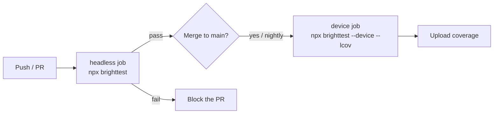

# CI integration

Run the **headless lane on every push** (fast gate, no hardware) and, optionally, the **device lane with
coverage** on a self-hosted runner or a schedule.



## Exit codes & reports

- `brighttest` exits non-zero on any test failure — fail the job on it.
- `--junit <path>` writes a JUnit XML report for test-result UIs.
- `--lcov [path]` (device lane) writes an LCOV file for coverage services (Coveralls/Codecov) or `genhtml`.

## GitHub Actions — headless gate

Runs on standard GitHub-hosted Linux runners; **no Roku required**.

```yaml
name: tests
on: [push, pull_request]

jobs:
  headless:
    runs-on: ubuntu-latest
    steps:
      - uses: actions/checkout@v4
      - uses: actions/setup-node@v4
        with:
          node-version: '20'
      - run: npm ci
      - run: npx brighttest --junit reports/junit.xml
      - if: always()
        uses: actions/upload-artifact@v4
        with:
          name: junit
          path: reports/junit.xml
```

## Device lane with coverage (optional)

Coverage needs a real Roku, so this job requires a **self-hosted runner** on the same network as a dev
device (or a device farm). Gate it to merges or a nightly schedule to avoid contention.

```yaml
  device-coverage:
    runs-on: [self-hosted, roku]          # a runner that can reach the device
    needs: headless
    if: github.ref == 'refs/heads/main'   # e.g. only on main
    steps:
      - uses: actions/checkout@v4
      - uses: actions/setup-node@v4
        with:
          node-version: '20'
      - run: npm ci
      - name: Run on device + collect coverage
        env:
          ROKU_HOST: ${{ secrets.ROKU_HOST }}
          ROKU_PASSWORD: ${{ secrets.ROKU_PASSWORD }}
        run: npx brighttest --device --host "$ROKU_HOST" --password "$ROKU_PASSWORD" --lcov coverage/lcov.info
      - name: Upload coverage
        uses: coverallsapp/github-action@v2
        with:
          path-to-lcov: coverage/lcov.info
```

::: warning Never hard-code device credentials
Put the device IP and developer password in CI **secrets** (`ROKU_HOST`, `ROKU_PASSWORD`) and pass them
via `env:`, as above. Don't inline them in the workflow or commit them.
:::

## Recommended split

| Trigger | Lane | Why |
|---|---|---|
| Every push / PR | Headless | Fast, hardware-free gate; blocks broken logic immediately. |
| Merge to main / nightly | Device + coverage | Slower; needs hardware. Produces coverage + catches node-level regressions. |

## Coverage services

`coverage/lcov.info` is standard LCOV, so it feeds Coveralls, Codecov, or a local HTML report:

```bash
genhtml coverage/lcov.info --output-directory coverage/html
```

brighttest filters framework-internal records out of the LCOV automatically, so reported coverage reflects
*your* code.
