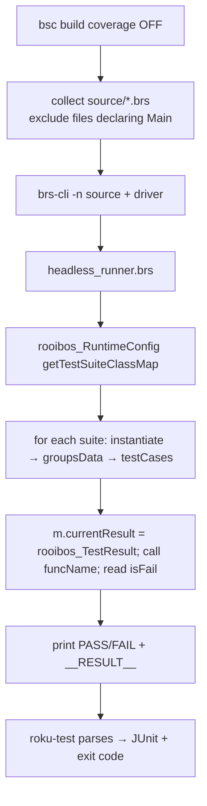

# Maintainer internals

For anyone hacking on roku-test itself. It's a small orchestration layer — no framework code of its own.

## Package layout

```
roku-test/
├── bin/cli.js              # arg parsing, lane dispatch, exit code
├── lib/
│   ├── config.js           # load roku-test.json; generate per-lane bsconfig
│   ├── headless.js         # build (coverage off) → drive on brs-node → parse → JUnit
│   ├── device.js           # build (coverage on) → stock Rooibos CLI → scrape LCOV
│   └── tools.js            # resolve dependency bins / plugin path regardless of hoisting
├── brs/headless_runner.brs # the headless Rooibos driver (runs on the simulator)
├── docs/                   # this VitePress site (not published to npm)
└── package.json            # deps: brighterscript, rooibos-roku, brs-node
```

## Dependency resolution (`tools.js`)

`resolveBin(pkg, binName)` and `resolvePackageMain(pkg)` use `require.resolve` with
`paths: [process.cwd(), __dirname, ..]`, so the toolchain resolves whether it's hoisted into the
consumer's `node_modules` (published install) or nested under roku-test (local `file:` link). The Rooibos
plugin is passed to `bsc` as an **absolute path** for the same reason.

## Config generation (`config.js`)

`writeBsConfig(cfg, lane, extra)` writes a bsconfig into `<stagingDir>/<lane>/bsconfig.json`:

- both lanes: `plugins: [<abs path to rooibos-roku>]`, `testsFilePattern`, source globs.
- headless: `isRecordingCodeCoverage: false`.
- device: `isRecordingCodeCoverage: true`, `createPackage: true`, and `printLcov: true` when `--lcov`.

## Headless lane



The driver reuses Rooibos's **own** `BaseTestSuite` assertions and `TestResult`; only the scene-based
`TestRunner` is replaced. That's why headless and device results are identical. It honors
`setupFunctionName` / `beforeEachFunctionName` / `afterEachFunctionName` / `tearDownFunctionName` and
supports `@params` arity 0–6.

## Device lane (`device.js`)

- Without `--lcov`: `spawnSync(rooibos, …, { stdio: 'inherit' })` — stream through.
- With `--lcov`: capture output, echo it, then `extractLcov(output)`:
  - accumulate `TN:/SF:/DA:\d+,\d+/LF:\d+/LH:\d+` into a record until `end_of_record`;
  - drop records whose `SF:` path matches `(^|/)rooibos/` (framework-injected);
  - join and write to the `--lcov` path.
- `extractLcov` is exported for unit testing.

## Rooibos coupling & upgrade risk

The headless driver depends on Rooibos's compiled shape: the `RuntimeConfig` suite map, `suite.groupsData`,
`testCase.funcName`/`rawParams`, and `rooibos_TestResult` / `BaseTestSuite` semantics. These are stable
across current Rooibos 5.x but are **internal**, not a public API. When bumping `rooibos-roku`:

1. Run the headless lane against a known suite and confirm counts match the device lane.
2. If the suite metadata shape changed, update `headless_runner.brs`.
3. If the LCOV console format changed, update `extractLcov` in `device.js`.

## Docs site

VitePress lives in `docs/` (excluded from the npm `files` list, so it isn't published).

```bash
npm run docs:dev       # local preview
npm run docs:build     # static site → docs/.vitepress/dist
npm run docs:preview   # serve the built site
```

Mermaid diagrams render via `vitepress-plugin-mermaid`. Content is plain Markdown; the sidebar/nav lives
in `docs/.vitepress/config.mts`.

## Publishing

`dependencies` (not devDependencies) list the runtime toolchain so a normal `npm i -D roku-test` pulls it
transitively. Docs tooling (`vitepress`, `mermaid`) are devDependencies and aren't shipped. For local
development use `file:` linking and run `npm install` inside `roku-test/` once so its `node_modules` is
populated.
