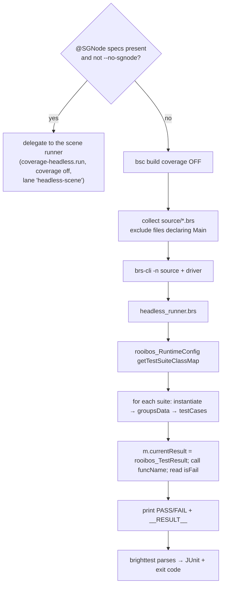

# Maintainer internals

For anyone hacking on brighttest itself. It's a small orchestration layer — no framework code of its own.

## Package layout

```
brighttest/
├── bin/cli.js               # arg parsing, lane dispatch, exit code (flag lanes + `skills`/`init`/`e2e` subcommands)
├── lib/
│   ├── config.js            # load brighttest.json; generate per-lane bsconfig
│   ├── headless.js          # build (SceneGraph off) → drive on brs-node → parse → JUnit
│   ├── coverage-headless.js # build (coverage on) → stock Rooibos on brs-node → LCOV + node tests
│   ├── device.js            # build (coverage on) → stock Rooibos CLI → scrape LCOV
│   ├── cross-check.js       # run headless + device, diff the overlap for fidelity
│   ├── e2e/                 # the on-device UI test lane (see "E2E lane" below)
│   └── tools.js             # resolve dependency bins / plugin path regardless of hoisting
├── brs/headless_runner.brs  # the headless Rooibos driver (runs on the simulator)
├── docs/                    # this VitePress site (not published to npm)
├── experiments/             # spike scripts + device FINDINGS (not shipped) — see "E2E lane"
├── design/                  # RFC/design notes, e.g. design/e2e-lane.md (not shipped)
├── examples/sample-app/     # runnable sample exercising every lane (not shipped)
└── package.json             # deps: @ramonlobo/brs-node, @ramonlobo/rooibos-roku, brighterscript
```

Only `bin`, `lib`, `brs`, `skills`, `README.md`, `LICENSE` (+ `patches`) are in the `files` array, so
`docs/`, `experiments/`, `design/`, `examples/`, and `test/` **do not ship to npm** — they're repo-only.

## Delivery model

brighttest depends on two **published, scoped fork packages** that carry the engine and framework changes
which make headless SceneGraph testing work:

- **`@ramonlobo/brs-node`** — the brs-engine simulator with the SceneGraph field-fidelity fixes.
- **`@ramonlobo/rooibos-roku`** — Rooibos with the headless + resilient-device support, global-context
  seeding, and the `@deviceOnly` annotation.

A plain `npm i -D brighttest` pulls both from npm — there is **no vendoring, no `patch-package`, and no
postinstall step**. To change engine or framework behavior, edit the corresponding fork
([Ramon-Lobo/brs-engine](https://github.com/Ramon-Lobo/brs-engine),
[Ramon-Lobo/rooibos](https://github.com/Ramon-Lobo/rooibos)), bump its version and publish, then bump the
dependency here. The eventual goal is to upstream these fixes and depend on the stock packages.

::: warning Historical sections below
The sections on `patch-package` and vendored `brs-node` bundles describe the **pre-publication** model.
Those fixes now live in the fork sources and ship inside the published packages above — brighttest no
longer patches or vendors anything at install time. They're kept for context on *what* the fixes were.
:::

## Dependency resolution (`tools.js`)

`resolveBin(pkg, binName)` and `resolvePackageMain(pkg)` use `require.resolve` with
`paths: [process.cwd(), __dirname, ..]`, so the toolchain resolves whether it's hoisted into the
consumer's `node_modules` (published install) or nested under brighttest (local `file:` link). The Rooibos
plugin is passed to `bsc` as an **absolute path** for the same reason.

## Config generation (`config.js`)

`writeBsConfig(cfg, lane, extra)` writes a bsconfig into `<stagingDir>/<lane>/bsconfig.json`:

- both lanes: `plugins: [<abs path to rooibos-roku>]`, `testsFilePattern`, source globs.
- headless: `isRecordingCodeCoverage: false`.
- device: `isRecordingCodeCoverage: true`, `createPackage: true`, and `printLcov: true` when `--lcov`.
- both lanes also set **`failFast: false`**. Rooibos's `failFast` defaults *on* in this build, which means
  one failing suite silently halts every suite that sorts after it (we hit this: a widget suite with 8
  failures hid 71 passing tests and dropped coverage from ~26% to ~2%). A runner must run everything.
- `diagnosticFilters` = `[1107]` merged with any codes from `brighttest.json`'s `diagnosticFilters`. 1107
  (redundant `<script>`) is always silenced because `autoImportComponentScript` makes it noise. Projects
  add more as needed — common ones for `@SGNode` specs: **1140** ("cannot find function") when a spec calls
  the component's own subs (they resolve at runtime inside the generated node but not in the spec's static
  scope), and **1002** (arg-count) for app code the device compiler tolerates.

## Headless lane

The default lane (`headless.js`) picks one of two execution strategies:



- **SceneGraph-off fast driver** (no node specs, or `--no-sgnode`): `brs-cli -n` + `headless_runner.brs`.
  The driver reuses Rooibos's **own** `BaseTestSuite` assertions and `TestResult`; only the scene-based
  `TestRunner` is replaced. That's why headless and device results are identical. It honors
  `setupFunctionName` / `beforeEachFunctionName` / `afterEachFunctionName` / `tearDownFunctionName` and
  supports `@params` arity 0–6. It **cannot** host `@SGNode` suites (no scene), so it skips them.
- **Scene runner** (node specs present): delegates to `coverage-headless.run(cfg, { coverage: false })`,
  which boots a real SceneGraph scene via the stock Rooibos runner (lane `headless-scene`) so `@SGNode`
  suites — including `onChange` cascades — run. Same code path as `--coverage`, minus LCOV. `--no-sgnode`
  forces the fast driver instead (and, on scene lanes, negates node specs out of the build).

## Device lane (`device.js`)

- Without `--lcov`: `spawnSync(rooibos, …, { stdio: 'inherit' })` — stream through.
- With `--lcov`: capture output, echo it, then `extractLcov(output)`:
  - accumulate `TN:/SF:/DA:\d+,\d+/LF:\d+/LH:\d+` into a record until `end_of_record`;
  - drop records whose `SF:` path matches `(^|/)rooibos/` (framework-injected);
  - join and write to the `--lcov` path.
- `extractLcov` is exported for unit testing.

## E2E lane (`lib/e2e/`)

A separate, self-contained subsystem from the Rooibos lanes: it drives a **running** app on a real device
over stock ECP and asserts on the live SceneGraph. No brs-node, no Rooibos, **no new runtime deps** — only
core `fs`/`path`/`crypto` + global `fetch`. User-facing docs are under [E2E](/e2e/); this is the internals.

### Module map

| Module | Role |
|---|---|
| `ecp.js` | ECP driver: `launch`/`keypress`/`text`/`deviceInfo`, and dev **screenshots over HTTP Digest** (hand-rolled with `node:crypto` — `fetch` has no digest — + a manual multipart body) |
| `sgnodes.js` | fetch `query/sgnodes/all` with retry/backoff on render-thread RPC timeouts; settle-wait; tolerant XML→tree parser; typed errors (`LIMITED_MODE`, `CHANNEL_NOT_RUNNING`) |
| `select.js` | selector matching over the parsed tree (`id`→`name=`, subtype, text, uri, index, filters) |
| `navigate.js` | focus path-finding: geometry-driven D-pad loop with edge/convergence guards |
| `flow.js` | YAML-subset parser → shared step model, line-referenced errors (no `yaml` dep) |
| `run.js` | the lane: preflight, `buildPlan` (matrix × device sharding), per-device `runHost`, step exec, reporting, exit codes; `parseTargets` resolves per-host passwords |
| `record.js` | interactive TTY recorder → scaffolds a flow (`Recorder` is pure/testable) |
| `stamp-ids.js` | build-time `id` injection — a **bsc plugin** (`beforeFileParse` rewrites component XML) + a source transform |
| `video.js` | optional `--video`: assemble per-step screenshots into mp4/gif via **ffmpeg** (external, optional; skipped with a note if absent) |

The pure parts (parser, selector, navigator algorithm against a simulated grid, recorder, id-stamper, run
planner, digest/multipart helpers) are unit-tested under `test/e2e*.test.js`; device behaviour is validated
on a real Roku.

### Device/ECP facts that shaped it {#e2e-device-facts}

These were established on real hardware (Roku Ultra, fw 15.2.4) and are recorded in
`experiments/FINDINGS.md`, `experiments/VIDEO-FINDINGS.md`, and `design/e2e-lane.md`. A maintainer touching
this lane should know them:

- **A node's `id` is serialized as the `name=` attribute** in `sgnodes`, and **custom fields are not
  dumped at all** — so a dedicated `testId` is invisible. The only reliable named hook is the built-in
  `id` (matched as `name=`); `stamp-ids.js` injects `id`, never a custom field.
- **ECP Network access must be Permissive** (Settings → System → Advanced → Control by mobile apps) or
  `sgnodes`/`keypress` are refused (`Limited mode` / HTTP 403). The lane preflight surfaces this.
- **`sgnodes` is a render-thread RPC**: it times out when the thread is busy (retry+settle) and fails with
  `Channel not running`/`not ready` right after launch (waited out). A **crash drops the app into the
  BrightScript debugger, which pegs the render thread** → every `sgnodes` read then times out; if you see
  persistent timeouts, telnet `:8085` for a runtime error, not a lane bug.
- **Screenshots cap at ~1 fps** (dev endpoint: generate + digest fetch ≈ 1.1s). Hence `--video` is an
  assembled slideshow, not motion capture; true video needs external HDMI capture.
- **`Lit_` text must be URL-encoded exactly once** — a space double-encoded to `Lit_%2520` returns 400
  (letters are unaffected, which masks it). `ecp.text()` passes the raw char; `keypress()` encodes once.
- **Render-thread components cannot call `pkg:/source` globals** (`func_name_resolver` fails → &h91). Share
  code with a component via an explicit `<script>` include, not a source global. (The sample app keeps a
  local `clamp` for this reason.)
- **Relaunching a running channel does not reset its scene**, and a `Keyboard` **persists its text** across
  relaunches. Flows should drive to a known state (e.g. a Back-to-Home preamble) rather than assume it.

### Multi-device & the app-vs-test-build split

- `run.js` runs one device per host in parallel; a single host streams live, multiple buffer per device and
  flush in host order. `parseTargets` accepts `--host ip:pw,ip2:pw2` so a mixed-password fleet can capture
  screenshots (ECP navigation needs no auth; the screenshot endpoint does).
- The e2e lane **does not build/deploy** — it assumes the app is already sideloaded. For a project that also
  has Rooibos specs, the app build for e2e must be plain `.brs`/`.xml` and **exclude `main.brs` from the
  Rooibos test build** (Rooibos owns the entry; the app's `Main()` would hang the runner). See the
  [sample app](https://github.com/Ramon-Lobo/brighttest/tree/main/examples/sample-app) and its README,
  which encode these constraints as working patterns and are the place to extend as the lane grows.

## Rooibos coupling & upgrade risk

The headless driver depends on Rooibos's compiled shape: the `RuntimeConfig` suite map, `suite.groupsData`,
`testCase.funcName`/`rawParams`, and `rooibos_TestResult` / `BaseTestSuite` semantics. These are stable
across current Rooibos 5.x but are **internal**, not a public API. When bumping `rooibos-roku`:

1. Run the headless lane against a known suite and confirm counts match the device lane.
2. If the suite metadata shape changed, update `headless_runner.brs`.
3. If the LCOV console format changed, update `extractLcov` in `device.js`.

## `@SGNode` headless patch {#sgnode-headless-patch}

This is the mechanism that lets `@SGNode` node suites run **headless** (in the `--coverage` lane and, by
extension, `--cross-check`). It's a two-hunk patch to `rooibos-roku`, applied automatically by
[patch-package](#patch-package-mechanics) on install and living in `patches/rooibos-roku+5.16.4.patch`.

### Root cause

Rooibos runs a node test by creating the generated `<Node>_component`, then waiting for its
`rooibosTestResult` field. Inside the node, the suite runs through Rooibos's **promise library**
(`rooibos_promises`): each async step is a `roSGNode` "promise" with a `promiseState` field, and listeners
are notified when that field changes — via `observeFieldScoped(promise, "promiseState", <callback-name>)`.

The callback name Rooibos passes is the *stringified anonymous function* (`callback.toStr()` → tokens →
`$anon_N`). **brs-node's `observeFieldScoped` returns `false` for an anonymous-function name and never
registers the observer.** So on the simulator the promise's `promiseState` changes but *nothing is
notified* — the promise chain never advances, `testSuiteDone` is never called, `rooibosTestResult` is never
set, and `runNodeTest` eventually logs *"did not indicate test completion"*. The suite hangs / is dropped.
(On real hardware the observer registers fine, so node tests always worked on `--device`.)

### The fix (two hunks)

**1. `rooibos_promises/promises.brs` — settle promises directly, not via the field observer.**
A new `rooibos_promises_internal_notifyPromise(promise)` does exactly what the observer callback used to do
(unregister, drain `then`/`catch`/`finally` listeners, re-run for listeners added during callbacks), but is
called **synchronously** from `resolve()`, `reject()`, and the already-settled branch of `internal_on()`.
The original observer-driven `internal_notifyListeners` now just delegates to it. This makes promises settle
in *every* environment without depending on `observeFieldScoped`. On device the still-registered observer
later fires but finds the storage already cleared → harmless no-op.

**2. `rooibos/TestRunner.bs` — `runInNodeMode` returns the result.** With hunk 1, the promise chain now
settles *synchronously inside* `testSuite.run()`, so `testSuiteDone` sets `rooibosTestResult` *before*
`run()` returns. But the generated node does `m.top.rooibosTestResult = nodeRunner.runInNodeMode(...)`, and
`runInNodeMode` was declared `as void` — so its `invalid` return value would immediately **overwrite** the
real result. The fix changes the signature to `as dynamic` and returns
`{ stats, tests, groups }` from the success path (and `return invalid`, not a bare `return`, from the
failure path — the **device** compiler rejects a bare `return` on a non-`void` function with
`Return must return a value`; brs-node is lenient, so this only surfaces on hardware).

### Why this is safe on device

Both lanes share the patched `rooibos-roku`, so the patch **must not regress the device lane.** It doesn't:
direct notification produces the same listener ordering, the leftover observer is a no-op, and
`runInNodeMode` now returns the same result the node already published. Verified: `--device` and
`--coverage` both report **76/76** on this project (incl. the Theme node suite), and `--cross-check` shows
**0 divergent**. Always re-run all three lanes after touching this patch.

### Scope

This patch makes node suites *run and settle* headless. On its own it doesn't make `onChange` handlers
fire — that's the separate [brs-node patch](#brs-node-onchange-patch) below. Together they give full
`@SGNode` fidelity headless (ButtonEx: **95/95, 0 divergent** vs device). What remains device-only is
behaviour tied to real wall-clock render timing — animations playing out over frames, Task-node I/O, live
remote input. The device lane is the fidelity reference for those; `--cross-check` polices the line.

## brs-node `onChange` patch {#brs-node-onchange-patch}

The companion to the rooibos patch. It lives in `lib/patch-brs-node.js` (an idempotent postinstall script,
**not** a patch-package patch — see [why](#why-a-script-not-patch-package)) and makes XML `onChange`
handlers fire during headless node tests.

### Root cause

brs-node batches SceneGraph field-change notifications. Setting a field calls `notifyObservers()`, which
normally queues the field and runs `flushNotificationQueue()` — but that flush is guarded by a static
`flushingNotifications` flag. Rooibos runs an **entire node suite inside one flush** (the suite is kicked
off by the `rooibosRunSuite` field observer, i.e. from within `dispatchObservers`). So every field a test
sets is *nested* inside that flush: `flushNotificationQueue()` early-returns, the field just sits on the
queue, and its `onChange` fires only after the whole suite ends — far too late for the test's assertions.

Net effect before the patch: `onChange` cascades (padding fan-out, text mirroring, focusPercent cross-fade,
disabled dimming) never ran headless — 87/95 with 8 observer tests failing, all flagged divergent by
`--cross-check`. Neither `m.wait()` nor an `@async` test helped: pumping the message loop doesn't drain the
*nested* queue (proven with a three-variant probe).

### The fix

One-line change to `notifyObservers` in the minified SG bundle (`brs-node/bin/brs-sg.node.js`): when a set
happens **while a flush is already in progress**, dispatch that field's observers **synchronously** instead
of queuing them:

```
// nested set → fire now, like real Roku's same-thread onChange
y.flushingNotifications ? this.dispatchObservers()
                        : (queue field; flushNotificationQueue())
```

This mirrors real hardware, where a same-thread field set fires `onChange` synchronously. Recursion is
bounded by brs-node's own per-observer `running` guard (a handler that re-sets its own or a mutually
observed field is skipped while already running), so cycles terminate the same way they would on device.

### Why it's safe

Blast radius is **headless only** — the device lane uses real hardware, not brs-node. It makes the
simulator *more* device-faithful, not less. Verified: the 87 non-observer tests still pass, the 8 observer
tests flip to pass, coverage rose 26% → 34% (the handler code now actually executes), and `--cross-check`
went to **0 divergent**. Re-run all three lanes after touching it.

## brs-node `roTextToSpeech` bundle {#brs-node-createobject-patch}

The third fix. Unlike the string-patches, this replaces the **core bundle** `brs.node.js` with a rebuild of
brs-node@2.2.0 that implements the `roTextToSpeech` component. `lib/patch-brs-node.js` copies the vendored
bundle (`vendor/brs-node/brs.node.js`) into `node_modules/brs-node/bin/` on postinstall (version-gated to
2.2.0). `brs-sg.node.js` delegates its component registry to `brs.node.js`, so swapping the core bundle
covers the SceneGraph lane too.

### Root cause

brs-node is a simulator and doesn't implement `roTextToSpeech`, which some apps create from a shared
audio-guide helper on most focusable widgets' init/focus path. `CreateObject` returns `invalid` for the
unknown class (brs-node@2.2.0 already does this — source `CreateObject.ts` returns `BrsInvalid.Instance`),
then the widget derefs it (`m.tts.say(...)`) → a fatal `EXIT_BRIGHTSCRIPT_CRASH` during node *init*, which
is uncatchable and aborts the whole run. Verified against a large production app: `roTextToSpeech` was the
**only** class it instantiated that brs-node lacked (roSGNode/roSGScreen are in the SG bundle).

### The fix

Implemented a headless `RoTextToSpeech` component in the brs-engine source
(`src/core/brsTypes/components/RoTextToSpeech.ts`, registered in `BrsObjects.ts`) and rebuilt the minified
bundle (`npm run release --prefix packages/node`). It's a functional no-op: no audio, `IsEnabled()` returns
false (so callers that gate speech on it cleanly skip), `Say`/`Silence` return an incrementing request id,
`Flush`/voice/language methods are no-ops. Widgets that create it now instantiate and run headless instead
of crashing. Verified: ButtonExGroup went from a hard TTS crash to **16/0 headless**; a 7-widget TTS batch
had 6 widgets instantiate and run (35 pass) where all previously hard-crashed.

### Source & rebuild (to regenerate the vendored bundle)

- Source clone: `Roku/brs-engine` (lvcabral/brs-engine) checked out at tag `v2.2.0`.
- The class: `src/core/brsTypes/components/RoTextToSpeech.ts` (+ one import and one registry line in
  `src/core/brsTypes/components/BrsObjects.ts`).
- Build: `npm install` then `npm run build:api && npm run release --prefix packages/node` → produces
  `packages/node/bin/brs.node.js` (minified). Copy it to `brighttest/vendor/brs-node/brs.node.js`.
- **Preferred long-term:** upstream `RoTextToSpeech.ts` as a PR to lvcabral/brs-engine; once released, bump
  `brs-node` and delete the vendored bundle + this install step.

### Remaining limitation (not TTS)

Implementing roTextToSpeech does **not** fix components whose `init()` needs real field context that a bare
Rooibos node doesn't provide (e.g. a dialog whose `init()` derefs a not-yet-built child, or a Type Mismatch
from an unset field). Those still crash node creation and must be handled per-component (wrapper/field setup) or
run on `--device`. Many widget *tests* also crash per-test (caught) when they exercise methods needing
context — a test-authoring concern for the fix pass, not a platform gap.

### Why a script, not patch-package {#why-a-script-not-patch-package}

The brs-node bundles are 370 KB **single minified lines**. patch-package uses line-based diffs, so a
one-token change would embed the entire line twice (~750 KB) in the patch. `lib/patch-brs-node.js` instead
applies **both** brs-node patches (onChange in `brs-sg.node.js`, CreateObject-tolerance in `brs.node.js`) as
targeted, **idempotent**, version-aware string replacements: each no-ops if already applied, and if a target
string isn't found (brs-node changed) it prints a warning and exits 0 — **never failing `npm install`**.
The `postinstall` hook runs it after patch-package: `patch-package && node lib/patch-brs-node.js`. If you
bump `brs-node`, re-verify the `FIND` strings still match and re-run the lanes.

### patch-package mechanics {#patch-package-mechanics}

- `patches/rooibos-roku+5.16.4.patch` is generated with `npx patch-package rooibos-roku` after editing the
  files under `node_modules/rooibos-roku/dist/...`.
- `"postinstall": "patch-package"` re-applies it on every `npm install`, so a fresh install of the pristine
  package is re-patched automatically. `patches/` is in the `files` array so it ships with the package.
- To change the patch: edit the files in `node_modules/rooibos-roku/`, re-run `npx patch-package
  rooibos-roku`, then re-verify all three lanes.
- **Version pinning:** the patch filename encodes `5.16.4`. If you bump `rooibos-roku`, patch-package will
  warn that the patch doesn't match; regenerate it against the new version (and re-check the two hunks still
  apply — the promise library and `TestRunner` are internal and can move).
- **Distribution caveat:** patch-package patches a package's *own* `node_modules`. When brighttest is
  installed as a dependency and its deps are hoisted, the postinstall may not find the nested
  `rooibos-roku` to patch. This works cleanly for local/`file:` development (our current setup). For robust
  distribution the real fix is [Option A below](#alternatives-if-we-revert) (upstream PR) — decide before
  publishing.

### Alternatives if we revert {#alternatives-if-we-revert}

If the patch ever needs to be backed out, here are the fallbacks, in order of preference:

- **Option A — upstream PR (best).** Send hunk 1 (the anonymous-observer fix) to `rokucommunity/rooibos`;
  it's a genuine brs-node-compat bug and helps everyone. If merged, drop the patch entirely and bump the
  dep. Hunk 2 may not be needed upstream (it exists to cope with hunk 1's synchronous settling in the
  generated-node flow) — evaluate at PR time.
- **Option B — gated `runSync`.** Instead of fixing the promise dispatch, force node suites to run
  synchronously *only* under the headless-coverage lane: detect the simulator and have the node runner call
  a synchronous run path (drain groups/tests inline) rather than the promise-based async loop. Downsides we
  hit when prototyping this: it forces **all** node tests synchronous (breaks genuinely async node tests),
  it broke stats aggregation (counted 71 not 76 because merged node stats bypassed the normal path), and
  `runInNodeMode`'s `void` return still had to be worked around. It's strictly worse than the promise patch
  for correctness, but it's the fallback if hunk 1 ever proves unsafe on some device. Keep it **gated to the
  simulator** so the device lane is untouched.
- **Option C — accept device-only node tests.** The pre-patch behavior: skip `@SGNode` in `--coverage`,
  run them only on `--device`. `config.js` used to exclude node specs from the headless-coverage build via
  `findNodeSpecs()` negation globs — that's the code to restore. Simplest, but loses headless node testing.

## Docs site

VitePress lives in `docs/` (excluded from the npm `files` list, so it isn't published).

```bash
npm run docs:dev       # local preview
npm run docs:build     # static site → docs/.vitepress/dist
npm run docs:preview   # serve the built site
```

Mermaid diagrams render via `vitepress-plugin-mermaid`. Content is plain Markdown; the sidebar/nav lives
in `docs/.vitepress/config.mts`.

## Publishing

`dependencies` (not devDependencies) list the runtime toolchain so a normal `npm i -D brighttest` pulls it
transitively — including `patch-package`, which the `postinstall` hook runs to apply the [@SGNode headless
patch](#sgnode-headless-patch). Docs tooling (`vitepress`, `mermaid`) are devDependencies and aren't
shipped. `patches/` **is** in the `files` array so the patch ships. For local development use `file:`
linking and run `npm install` inside `brighttest/` once so its `node_modules` is populated (and patched).

Release flow: bump with `npm version <patch|minor|major>` (commits + tags `vX.Y.Z` on `main`), push the
branch **and the tag**, then `npm publish --access public`. The npm account has **2FA enabled**, so publish
prompts for a one-time password — pass it with `--otp=<code>` (it can't be automated interactively; use an
automation token for unattended CI releases). `npm pack --dry-run` before publishing to confirm the tarball
contents. `v0.3.0` was the first release carrying the e2e lane.

::: warning Before publishing
Resolve the patch-package [distribution caveat](#patch-package-mechanics): a hoisted `rooibos-roku` in a
consumer install may not be re-patched by brighttest's `postinstall`. Prefer landing the [upstream
PR](#alternatives-if-we-revert) so the dep can be bumped and the patch dropped. This is an open decision,
not a solved problem.
:::
