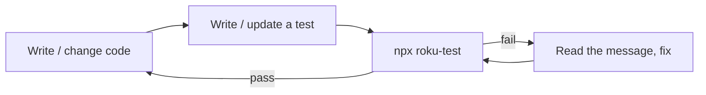

# 1. Your first test

We'll write a tiny piece of BrightScript, test it, watch the test pass, deliberately break it to see a
failure, and fix it. By the end you'll understand the whole loop.

## Step 1 — Some code to test

Create `source/mathutils.brs` with a plain function. Nothing special — this is ordinary BrightScript that
your app could use anywhere:

```brightscript
' source/mathutils.brs
function addNumbers(a as integer, b as integer) as integer
    return a + b
end function
```

::: info Why `source/`?
Roku only compiles BrightScript under `source/` and `components/`. Both your code and your test files must
live under one of those. We'll put tests in `source/tests/`.
:::

## Step 2 — A test for it

Create `source/tests/MathUtils.spec.bs`. (Note the `.bs` extension and the `.spec` in the name — the
default pattern is `**/*.spec.bs`.)

```brightscript
namespace tests
  @suite("math utils")
  class MathUtilsTests extends rooibos.BaseTestSuite

    @describe("addNumbers")

    @it("adds two positive numbers")
    function _()
      result = addNumbers(2, 3)
      m.assertEqual(result, 5)
    end function

  end class
end namespace
```

Don't worry about every keyword yet — the [next page](/writing-tests/anatomy) dissects it line by line.
For now: the `@it` function calls your code and asserts the result equals `5`.

## Step 3 — Run it (headless)

From your project root:

```bash
npx roku-test
```

You should see something like:

```
roku-test: headless lane

  ✓ addNumbers > adds two positive numbers

====================================================
  roku-test (headless): 1 passed, 0 failed
====================================================
```

That ran with **no Roku device** — on a BrightScript simulator in Node, in well under a second. This is
your everyday feedback loop.

## Step 4 — Watch it fail

A test you've never seen fail is a test you don't trust. Change the assertion to expect the wrong answer:

```brightscript
m.assertEqual(result, 6)   // wrong on purpose
```

Run again:

```
  ✗ addNumbers > adds two positive numbers  — expected "5 (Integer)" to equal "6 (Integer)"

  roku-test (headless): 0 passed, 1 failed
```

The command also **exits non-zero**, which is how CI knows the build is broken. Notice the message shows
both the actual value (`5`) and what you expected (`6`) — that's what makes failures easy to diagnose.

Now put it back to `5` and confirm it passes again.

## Step 5 — (Optional) run on a device with coverage

If you have a Roku in developer mode, the *same file* runs on hardware and reports coverage:

```bash
npx roku-test --device --host <roku-ip> --password <dev-pw> --lcov coverage/lcov.info
```

You'll get the same pass/fail result plus a coverage summary and a `coverage/lcov.info` file. You don't
need this for day-to-day work — headless is the fast loop — but it's there when you want coverage or need
to test SceneGraph nodes.

## The loop you'll repeat forever



That's it — you've written and run a test. Next, let's understand exactly what each part of that spec file
does.
