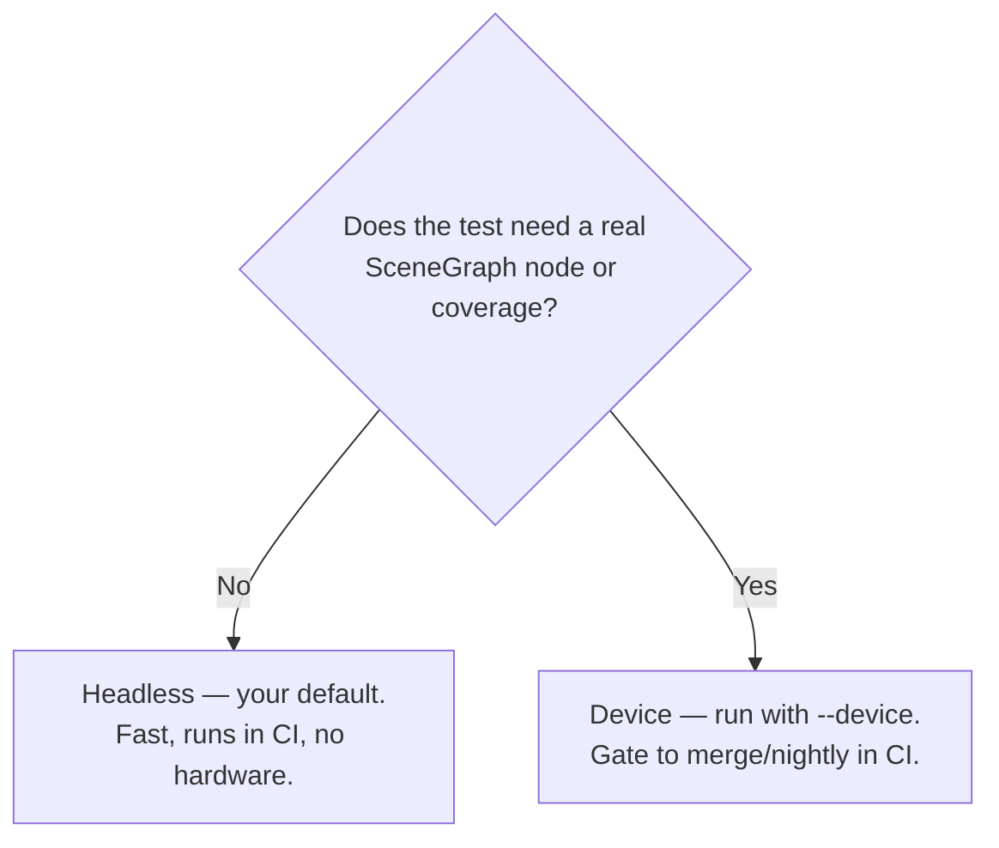

# 9. Headless vs device

You write one kind of test, but where it can *run* depends on what it touches. Understanding the split lets
you keep the vast majority of tests in the fast headless lane.

## Run modes

| Command | Device? | Coverage? | Node (`@SGNode`) tests? | Speed |
|---|---|---|---|---|
| `roku-test` (default) | no | no | **yes (headless)** | fast¹ |
| `roku-test --no-sgnode` | no | no | skipped | fastest |
| `roku-test --coverage` | no | **yes (+LCOV)** | **yes (headless)** | slower (runs a scene) |
| `roku-test --coverage --no-sgnode` | no | yes (+LCOV) | skipped | slower |
| `roku-test --device …` | yes | yes (+LCOV) | **yes** | slowest |
| `roku-test --cross-check …` | yes | — | both lanes | slowest (both lanes) |

¹ The default lane runs `@SGNode` suites headless when your project has them (it boots a SceneGraph scene
for that). With no node specs — or with `--no-sgnode` — it uses the faster SceneGraph-off driver. So
node tests run **by default**; `--no-sgnode` is the opt-out when you want the quickest possible inner loop.

`--cross-check` runs every suite **both** headless and on the device and diffs the results — it fails if any
test behaves differently, so you can trust the headless lane as a proxy for the device. See
[Verifying fidelity](#verifying-fidelity-cross-check).

## The capability matrix

| Your test touches… | Headless (default) | Headless `--coverage` | Device |
|---|---|---|---|
| Pure logic — math, parsing, formatting, validation, state | ✅ | ✅ | ✅ |
| Strings, arrays, associative arrays | ✅ | ✅ | ✅ |
| `roByteArray`, base64, `roRegex`, `roDateTime` | ✅ | ✅ | ✅ |
| Crypto — `roEVPDigest` (md5), `roHMAC`, `roEVPCipher` | ✅ | ✅ | ✅ |
| **Code coverage / LCOV** | — | ✅ **(no device!)** | ✅ |
| `@SGNode` component **logic** — call funcs/subs, computed state | ✅¹ | ✅ | ✅ |
| `@SGNode` **`onChange` observer cascades** — set field → handler reacts | ✅¹ | ✅ | ✅ |
| Real wall-clock render timing — animations, Task I/O, live remote input | ⚠️ simulated | ⚠️ simulated | ✅ (reference) |

¹ The default lane runs `@SGNode` suites headless when your project has them (booting a scene); pass
`--no-sgnode` to skip them and use the faster SceneGraph-off driver. Only `--no-sgnode` turns these two
rows into ❌ for the default lane.

**Coverage and full `@SGNode` component behaviour — including `onChange` observer cascades — are no longer
device-only.** They run headless (by default, and under `--coverage`), made faithful by two patches: node
suites complete, and `onChange` fires synchronously. A complex widget cross-checked at **95/95, 0
divergent**. What stays device-only is behaviour tied to **real wall-clock timing** — animations playing
out over frames, Task-node I/O, live remote input. The device lane is the **fidelity reference**;
`--cross-check` polices it.

::: tip Headless coverage + node tests — no device required
`roku-test --coverage` runs the **stock Rooibos runner on the brs-node simulator** (SceneGraph enabled),
writes LCOV, **and** runs `@SGNode` node suites — the latter via a small [rooibos-roku
patch](/maintainers#sgnode-headless-patch) roku-test ships. It's slower than the default lane (it boots a
scene), so use the default for the fast inner loop and `--coverage` when you want coverage and/or node
tests — including in CI, with no hardware.
:::

## Why the split exists

- The **default** headless lane runs a lightweight driver on brs-node with SceneGraph disabled — fastest,
  but no coverage (coverage instrumentation reports through a SceneGraph collector node).
- The **`--coverage`** lane enables brs-node's SceneGraph and runs Rooibos's real scene-based runner, so the
  coverage collector's field observers work — yielding coverage + LCOV headless.
- **`@SGNode` node tests** also run in the `--coverage` lane, in full. Two brs-node/Rooibos gaps had to be
  closed, both via patches roku-test ships: node suites didn't *complete* (Rooibos's promise library relies
  on a field observer brs-node rejects → [rooibos-roku patch](/maintainers#sgnode-headless-patch)), and XML
  `onChange` handlers didn't *fire* mid-test (brs-node batches notifications →
  [brs-node patch](/maintainers#brs-node-onchange-patch) dispatches them synchronously, like real Roku).
  What's still best verified on **device**: behaviour tied to real wall-clock render timing.

There is no desktop Roku emulator, but coverage and full `@SGNode` component testing no longer require
hardware.

## Deciding where a test runs



You don't mark tests for a lane — a test runs headless if the code it exercises works on the simulator.
The device lane simply runs *everything* (including the headless-capable tests) and adds coverage.

## Designing for the fast lane

The single most valuable habit: **keep business logic in pure functions, out of node code.** Then almost
everything is headless-testable.

**Instead of** logic buried in a node callback:

```brightscript
sub onPriceChanged()
    if m.top.price > 100 then
        m.top.badge = "premium"
    else
        m.top.badge = "standard"
    end if
end sub
```

**Extract** the decision into a pure function:

```brightscript
' pure — headless-testable
function tierForPrice(price as integer) as string
    if price > 100 then return "premium"
    return "standard"
end function
```

```brightscript
sub onPriceChanged()
    m.top.badge = tierForPrice(m.top.price)   ' node stays thin
end sub
```

Now `tierForPrice` gets fast, parameterized headless tests, and the node needs at most a thin device test.

## Verifying fidelity (cross-check)

The headless simulator (brs-node) is a re-implementation, not the real firmware, so in rare cases a test
can behave differently on device (e.g. `roEVPDigest` returns `""` for an empty-string md5 on hardware but
the correct hash on the simulator). To keep the fast headless lane trustworthy, run the cross-check:

```bash
npx roku-test --cross-check --host <roku-ip> --password <dev-pw>
```

It runs every non-node suite **both** headless and on the device, matches tests by name, and reports:

```
agree            : 76   (same result in both lanes)
device-only      : 0    (ran on device but not headless)
DIVERGENT        : 0    (headless ≠ device — fidelity risk)
✓ No divergence. Headless results match the device for all 76 shared tests.
```

Because `@SGNode` suites now run headless too, they're cross-checked as well — the example above includes
this project's Theme node suite, verified identical on both lanes.

Any divergent test is listed with its headless vs device result, and the run fails (exit ≠ 0). Run it
periodically (e.g. nightly) so you learn immediately if the simulator stops being a faithful proxy for your
code. This turns "the simulator might differ" from an unknown risk into a monitored one.

## Practical workflow

- **Every change:** run `npx roku-test` (headless, no device) — runs everything, `@SGNode` included. For a
  sub-second pure-logic loop, add `--no-sgnode` to skip the scene boot.
- **Coverage in CI (no device):** `npx roku-test --coverage --lcov coverage/lcov.info`.
- **Before merge / nightly:** `npx roku-test --device …` for on-device coverage + real render timing, and
  `npx roku-test --cross-check …` to confirm headless still matches the device.

## Common questions

**"Can I get coverage headless?"** Yes — `roku-test --coverage` produces coverage + LCOV with no device.

**"My crypto test — headless or device?"** Headless works: brs-node implements `roEVPDigest`/`roHMAC`.

**"Can I run `@SGNode` tests without a device?"** Yes — they run headless in the **default** lane and under
`--coverage`, including `onChange` cascades. Only real wall-clock timing (animations, Task I/O) needs
`--device`; use `--cross-check` to confirm fidelity.

**"Can I skip `@SGNode` suites for a faster run?"** Yes — `npx roku-test --no-sgnode` skips them and uses
the SceneGraph-off driver. That's the only case where the default lane won't run your node tests.

Next: a cookbook of ready-to-adapt recipes.
