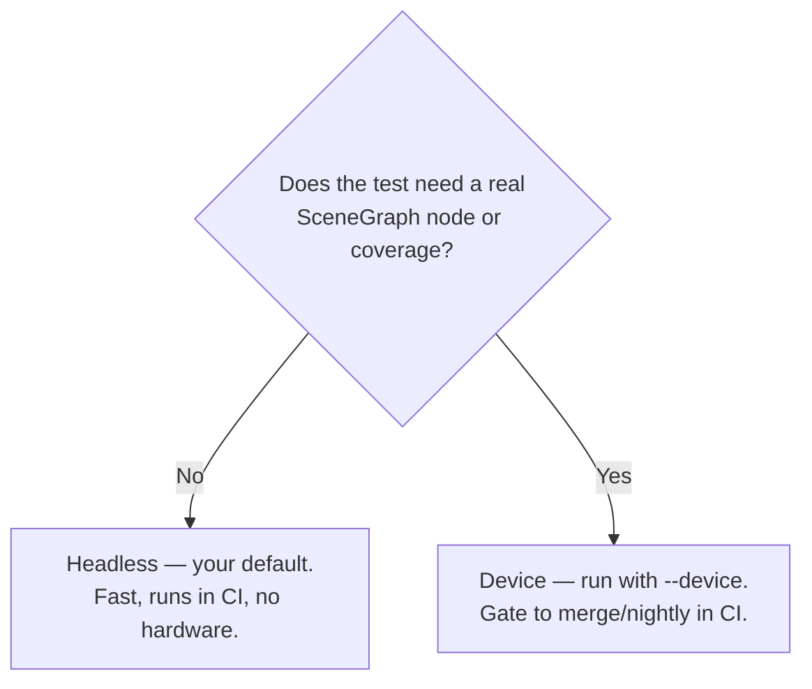

# 9. Headless vs device

You write one kind of test, but where it can *run* depends on what it touches. Understanding the split lets
you keep the vast majority of tests in the fast headless lane.

## The capability matrix

| Your test touches… | Headless (brs-node) | Device |
|---|---|---|
| Pure logic — math, parsing, formatting, validation, state | ✅ | ✅ |
| Strings, arrays, associative arrays | ✅ | ✅ |
| `roByteArray`, base64, `roRegex`, `roDateTime` | ✅ | ✅ |
| Crypto — `roEVPDigest` (md5), `roHMAC`, `roEVPCipher` | ✅ | ✅ |
| SceneGraph nodes — `@SGNode`, fields, observers, rendering | ❌ | ✅ |
| **Code coverage / LCOV** | ❌ | ✅ |

Two things are device-only: **SceneGraph node behavior** and **code coverage**. Everything else — including
crypto — runs headless.

::: tip SceneGraph node tests run on the device lane
Headless **skips** `@SGNode` suites automatically; the **device lane runs them** (and reports coverage) —
see [SceneGraph & async tests](/writing-tests/scenegraph-async). roku-test enables the required
`autoImportComponentScript` compiler option for you. Still, keep logic in pure functions to maximize the
fast headless lane.
:::

## Why the split exists

- The headless lane runs on the **brs-node** BrightScript simulator. It implements a broad set of Roku
  components (enough for logic and even crypto), but its SceneGraph support is experimental — so it can't
  run the node render thread that `@SGNode` tests and Rooibos's coverage collector rely on.
- **Coverage** is tallied at runtime by an on-device SceneGraph component, so it only exists in the device
  lane. (roku-test still writes the LCOV file *from* that device run — see [CI](/guide/ci).)

There is no desktop Roku emulator, so this boundary is a property of the platform, not of roku-test.

## Deciding where a test runs



You don't mark tests for a lane — a test runs headless if the code it exercises works on the simulator.
The device lane simply runs *everything* (including the headless-capable tests) and adds coverage.

## Designing for the fast lane

The single most valuable habit: **keep business logic in pure functions, out of node code.** Then almost
everything is headless-testable.

**Instead of** logic buried in a node callback:

```brightscript
sub onPriceChanged()
    if m.top.price > 100 then
        m.top.badge = "premium"
    else
        m.top.badge = "standard"
    end if
end sub
```

**Extract** the decision into a pure function:

```brightscript
' pure — headless-testable
function tierForPrice(price as integer) as string
    if price > 100 then return "premium"
    return "standard"
end function
```

```brightscript
sub onPriceChanged()
    m.top.badge = tierForPrice(m.top.price)   ' node stays thin
end sub
```

Now `tierForPrice` gets fast, parameterized headless tests, and the node needs at most a thin device test.

## Practical workflow

- **Every change:** run `npx roku-test` (headless). Sub-second, no device.
- **Before merge / nightly:** run `npx roku-test --device --host … --password … --lcov …` for coverage and
  node tests.
- **In CI:** headless on every push (blocks broken logic instantly); device+coverage gated to main/nightly
  on a self-hosted runner.

## Common questions

**"Can I get coverage headless?"** No — coverage is device-only by platform design. Run the device lane for
coverage numbers and LCOV.

**"My crypto test — headless or device?"** Headless works: brs-node implements `roEVPDigest`/`roHMAC`.

**"A node test fails headless with a crash."** Expected — node tests need the device. Run them with
`--device`, and consider extracting the logic (previous page).

Next: a cookbook of ready-to-adapt recipes.
