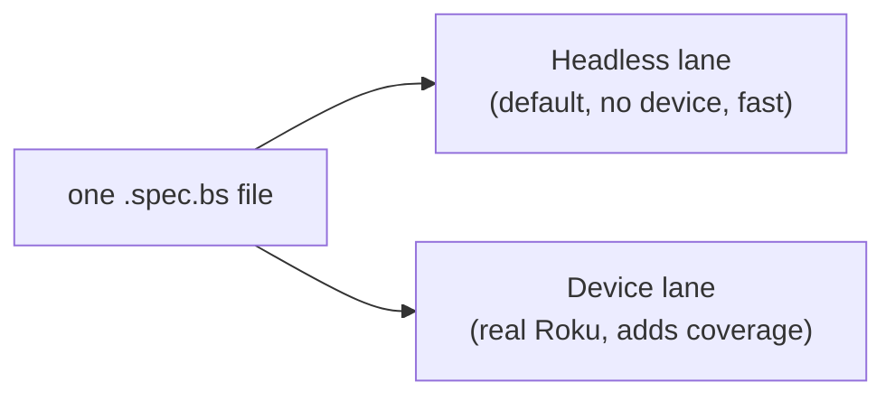

# Writing tests — start here

This guide teaches you to write automated tests for a Roku/BrightScript project **from scratch**. It
assumes you have **never** used Rooibos, BrighterScript, or any BrightScript test tool before. No prior
testing experience is required — we define every term the first time it appears.

## What is a unit test?

A **unit test** is a small program that runs one piece of your code with known inputs and checks that it
produces the expected output. If the check fails, the test "fails" and tells you what went wrong. Tests
let you change code confidently: run them, and if they still pass, you probably didn't break anything.

A trivial example, in plain English:

> Given `add(2, 3)`, I expect the result to be `5`. If it isn't, fail and show me what I got instead.

That "I expect … to be …" line is called an **assertion**. A test is mostly a few lines of setup followed
by one or more assertions.

## The mental model for this project

You write tests **once**, in [Rooibos](https://github.com/rokucommunity/rooibos) syntax, and run them two ways:

- **Headless** is your everyday loop: instant feedback, runs in CI, no hardware. Most tests live here.
- **Device** is for code that needs a real Roku (SceneGraph UI nodes) and for producing **code coverage**.

The same file works in both. You don't write two kinds of tests — you write one kind, and some of them
simply can't run headless (we'll show you exactly which).

## Vocabulary you'll see

| Term | Meaning |
|---|---|
| **Assertion** | A check like `m.assertEqual(actual, expected)`. A failed assertion fails the test. |
| **Test** (`@it`) | One scenario with a name and some assertions. |
| **Group** (`@describe`) | A named bunch of related tests. |
| **Suite** (`@suite`) | A class holding groups and tests, usually one per file. |
| **Spec file** | A `*.spec.bs` file containing one or more suites. |
| **Fixture / setup** | Data or state prepared before a test runs. |
| **Test double** | A stand-in for a real dependency — a mock, stub, or spy. |
| **Headless** | Running without a Roku device (on a simulator in Node). |

## How this guide is organized

Read in order the first time; later, use it as a reference.

1. **[Your first test](/writing-tests/first-test)** — set up a project and watch a test pass, then fail, then pass.
2. **[Anatomy of a test file](/writing-tests/anatomy)** — every line of a spec, explained.
3. **[Assertions](/writing-tests/assertions)** — the full checklist of `m.assert*` methods.
4. **[Organizing tests](/writing-tests/organizing)** — suites, groups, and file layout.
5. **[Parameterized tests](/writing-tests/parameterized)** — run one test over many inputs.
6. **[Setup & teardown](/writing-tests/setup-teardown)** — shared fixtures and cleanup.
7. **[Mocks, stubs & spies](/writing-tests/test-doubles)** — isolating the unit under test.
8. **[SceneGraph & async tests](/writing-tests/scenegraph-async)** — testing nodes (device-only).
9. **[Headless vs device](/writing-tests/headless-vs-device)** — what runs where, and designing for it.
10. **[Cookbook](/writing-tests/cookbook)** — copy-paste recipes for common situations.
11. **[Common mistakes](/writing-tests/mistakes)** — the errors everyone hits, and their fixes.

::: tip Prerequisites
You need roku-test installed and a project set up. If you haven't done that, do the
[Quick start](/guide/getting-started) first (about five minutes), then come back here.
:::
