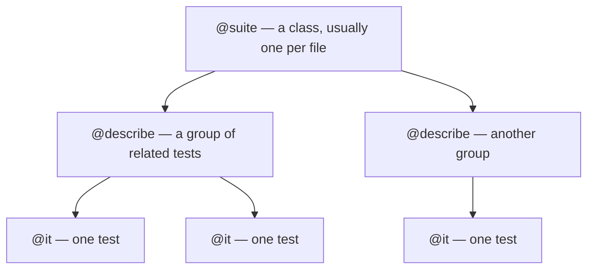

# 4. Organizing tests

As you add tests, structure keeps them readable and failures easy to locate.

## The three levels



- **Suite** (`@suite`) — one class per file, named after the thing it tests (`MathUtilsTests`).
- **Group** (`@describe`) — a labelled section inside a suite, usually one per function or behavior.
- **Test** (`@it`) — one scenario with a clear description.

## Multiple groups in one suite

Group by the function or behavior under test:

```brightscript
namespace tests
  @suite("string utils")
  class StringUtilsTests extends rooibos.BaseTestSuite

    @describe("trim")

    @it("removes leading and trailing spaces")
    function _()
      m.assertEqual(trim("  hi  "), "hi")
    end function

    @it("leaves an already-trimmed string alone")
    function _()
      m.assertEqual(trim("hi"), "hi")
    end function

    @describe("toTitleCase")

    @it("capitalizes each word")
    function _()
      m.assertEqual(toTitleCase("hello world"), "Hello World")
    end function

  end class
end namespace
```

Output groups the results:

```
✓ trim > removes leading and trailing spaces
✓ trim > leaves an already-trimmed string alone
✓ toTitleCase > capitalizes each word
```

## File and folder layout

Keep tests near what they test, all under a compiled path:

```
source/
├── framework/
│   ├── mathutils.brs
│   └── stringutils.brs
└── tests/
    ├── MathUtils.spec.bs
    └── StringUtils.spec.bs
```

Conventions that pay off:

- **One suite per file**, file named `<Thing>.spec.bs`.
- **Match the code**: a test file per source module makes it obvious what's covered.
- The `testsFilePattern` (default `**/*.spec.bs`) controls discovery — any `.spec.bs` under your source
  globs is picked up automatically. No manual registration.

## Naming that helps future-you

- Suite name: the module/feature — `@suite("cart pricing")`.
- Group name: the function/behavior — `@describe("applyDiscount")`.
- Test name: the scenario and expectation — `@it("caps the discount at 50%")`.

A failing test then reads like a sentence: `cart pricing › applyDiscount › caps the discount at 50%`.

## Skipping and focusing (during development)

Rooibos supports annotations to temporarily run only some tests while you iterate:

- `@only` on a test or group runs just that one (great for zeroing in).
- `@ignore` skips a test or group.

::: warning Don't commit `@only`
`@only` is a debugging aid. Committing it makes CI silently skip everything else. Remove it before you push.
:::

Next: running one test over many inputs with parameterized tests.
