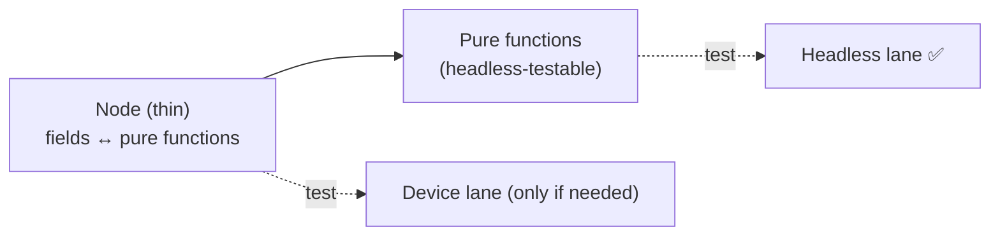

# 8. SceneGraph & async tests

Most of your tests should be pure logic that runs headless. But some behavior only exists inside a **real
SceneGraph node** — the UI layer of a Roku app. Those tests are **device-only**. This page explains when
you need them, how to write them, and how to keep them rare.

::: tip How it runs
The headless lane **detects and skips** `@SGNode` suites automatically (they need a device), so they
never break a headless run. On the **device lane** they run for real — deployed to hardware, executed on
the render thread, and reported back. roku-test sets the required `autoImportComponentScript` compiler
option for you (see the note below); without it, generated node components don't link their own script and
node tests hang. Even so, prefer extracting logic into pure functions and testing *those* headless — keep
`@SGNode` for genuinely UI-coupled behavior.
:::

## What is a SceneGraph (RSG) node?

A SceneGraph node is a UI/component object created from an XML component — it has fields, can render, runs
code on a separate render thread, and reacts to field changes via observers. Node behavior (rendering,
field observation, `createChild`, focus, animations) requires the real Roku runtime; a simulator can't
faithfully reproduce it.

::: warning These run on a device only
Node tests use the real render thread, so they run in the **device lane** (`--device`), not headless. The
headless simulator's SceneGraph support is experimental and won't run them.
:::

## `@SGNode` — running a test inside a node

Rooibos can host a suite *inside* a node so `m` has access to that node's context. You annotate the suite
with `@SGNode` naming the component to run in:

```brightscript
namespace tests
  @suite("Hud component")
  @SGNode("Hud")                         ' run these tests inside a Hud node
  class HudTests extends rooibos.BaseTestSuite

    @describe("offset")

    @it("moves the info group when offset changes")
    function _()
      ' m.top is the Hud node instance
      m.top.offset = [20, 0]
      m.assertEqual(m.top.infoGroup.translation[0], 20)
    end function

  end class
end namespace
```

Here `m.top` is the node under test. You can set fields, call the node's functions, and assert on the
resulting node state.

## Observing fields & asynchronous behavior

Node work is often **asynchronous** — you set a field, and a result appears later (after a render tick, a
task completes, or an observer fires). Rooibos provides helpers to wait for a field to change and then
assert, with a timeout so a stuck test fails instead of hanging.

The pattern is: trigger the change, wait for the field/observer, assert. (The exact helper names and the
async annotation live in the Rooibos docs and evolve across versions; the important idea is that async node
tests **wait for an observable signal** rather than assuming immediacy.)

```brightscript
@it("loads rows after data arrives")
function _()
    m.top.callFunc("requestData")
    ' wait for m.top.rows to be populated (observer/timeout), then:
    m.assertNotEmpty(m.top.rows)
end function
```

## Keep node tests rare — extract the logic

The best way to test node behavior is to have **very little logic in the node**. Push decisions into pure
functions and test *those* headless; let the node be a thin shell that wires fields to those functions.



Example: instead of computing a layout inside the node's `onOffsetChange`, compute it in a pure function:

```brightscript
' pure, headless-testable
function computeInfoTranslation(offset as object) as object
    return [offset[0], 0]
end function
```

Now the interesting logic has fast headless tests, and you only need a thin device test to confirm the node
wires the field through.

## Running node tests

```bash
npx roku-test --device --host <roku-ip> --password <dev-pw>
```

They run alongside your headless-capable tests on the device (the device lane runs *everything*). In CI,
gate the device lane to merges/nightly on a self-hosted runner — see [CI integration](/guide/ci).

## Rule of thumb

| Behavior | Where to test |
|---|---|
| Calculations, parsing, formatting, validation, state transitions | Headless (pure functions) |
| Field observers, rendering, focus, `createChild`, node lifecycle | Device (`@SGNode`) |

If you find yourself writing many node tests, that's usually a signal to move logic out of nodes. Next:
the full picture of what runs headless vs on device.
