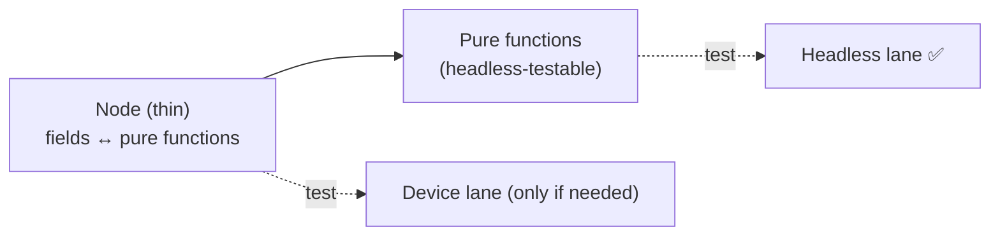

# 8. SceneGraph & async tests

Most of your tests should be pure logic that runs headless. But some behavior only exists inside a **real
SceneGraph node** — the UI layer of a Roku app. This page explains when you need them, how to write them,
and how to keep them rare.

::: tip How it runs
`@SGNode` suites run in two of the three lanes:

- **Default lane** (`brighttest`) — runs `@SGNode` suites headless when your project has them (it boots a
  SceneGraph scene). Pass `--no-sgnode` to skip them and use the faster SceneGraph-off driver (handy for a
  quick pure-logic inner loop).
- **Coverage lane** (`brighttest --coverage`) — a **headless** lane (no device) with SceneGraph enabled, so
  `@SGNode` suites run in full: component logic, computed state, **and** XML `onChange` observer cascades.
  This works via two patches brighttest ships — a [rooibos-roku patch](/maintainers#sgnode-headless-patch)
  (node suites complete headless) and a [brs-node patch](/maintainers#brs-node-onchange-patch) (`onChange`
  fires synchronously). The default lane runs the same node suites; `--coverage` just adds LCOV.
- **Device lane** (`brighttest --device`) — runs them for real on hardware.

brighttest sets the required `autoImportComponentScript` compiler option for you (see the note below);
without it, generated node components don't link their own script and node tests hang. Even with headless
node tests working, still prefer extracting logic into pure functions and testing *those* in the fast
default lane — keep `@SGNode` for genuinely UI-coupled behavior, and treat the **device lane as the fidelity
reference** for anything that leans on real render-thread timing.
:::

## What is a SceneGraph (RSG) node?

A SceneGraph node is a UI/component object created from an XML component — it has fields, can render, runs
code on a separate render thread, and reacts to field changes via observers. Node behavior (rendering,
field observation, `createChild`, focus, animations) requires the real Roku runtime; a simulator can't
faithfully reproduce it.

::: tip Node tests are headless too — including `onChange` observers
Stress-testing a complex widget (ButtonEx: layout math, key handling, opacity interpolation, **and field
observers**) through `--cross-check` gave **95/95 with 0 divergence** — headless matches the device
exactly. Both of these now work headless in `--coverage`:

- Calling the component's own functions/subs, reading/writing fields, pure computation.
- **XML `onChange` cascades**: "set `padding` → all four sides update", "set `text` → the label mirrors
  it", "set `focusPercent` → layers cross-fade". These fire on the simulator, matching hardware.

This needed a small [brs-node patch](/maintainers#brs-node-onchange-patch) brighttest ships — brs-node
normally batches field-change notifications and wouldn't fire `onChange` mid-test; the patch dispatches
them synchronously, like real Roku. What's still genuinely device-only: behavior that depends on **real
wall-clock render timing** (animations playing out, Task-node I/O, live remote input). Run
[`--cross-check`](/writing-tests/headless-vs-device#verifying-fidelity-cross-check) to confirm the two
lanes agree for your component.
:::

## `@SGNode` — running a test inside a node

Rooibos can host a suite *inside* a node so `m` has access to that node's context. You annotate the suite
with `@SGNode` naming the component to run in:

```brightscript
namespace tests
  @suite("Hud component")
  @SGNode("Hud")                         ' run these tests inside a Hud node
  class HudTests extends rooibos.BaseTestSuite

    @describe("offset")

    @it("moves the info group when offset changes")
    function _()
      ' m.top is the Hud node instance
      m.top.offset = [20, 0]
      m.assertEqual(m.top.infoGroup.translation[0], 20)
    end function

  end class
end namespace
```

Here `m.top` is the node under test. You can set fields, call the node's functions, and assert on the
resulting node state.

## Observing fields & asynchronous behavior

Node work is often **asynchronous** — you set a field, and a result appears later (after a render tick, a
task completes, or an observer fires). Rooibos provides helpers to wait for a field to change and then
assert, with a timeout so a stuck test fails instead of hanging.

The pattern is: trigger the change, wait for the field/observer, assert. (The exact helper names and the
async annotation live in the Rooibos docs and evolve across versions; the important idea is that async node
tests **wait for an observable signal** rather than assuming immediacy.)

```brightscript
@it("loads rows after data arrives")
function _()
    m.top.callFunc("requestData")
    ' wait for m.top.rows to be populated (observer/timeout), then:
    m.assertNotEmpty(m.top.rows)
end function
```

## Keep node tests rare — extract the logic

The best way to test node behavior is to have **very little logic in the node**. Push decisions into pure
functions and test *those* headless; let the node be a thin shell that wires fields to those functions.



Example: instead of computing a layout inside the node's `onOffsetChange`, compute it in a pure function:

```brightscript
' pure, headless-testable
function computeInfoTranslation(offset as object) as object
    return [offset[0], 0]
end function
```

Now the interesting logic has fast headless tests, and you only need a thin device test to confirm the node
wires the field through.

## Running node tests

```bash
# Headless (no device) — the default run already includes @SGNode suites:
npx brighttest

# Headless + coverage (no device):
npx brighttest --coverage

# On hardware — the fidelity reference for render-thread behavior:
npx brighttest --device --host <roku-ip> --password <dev-pw>
```

Node suites run headless by default (and under `--coverage`) — great for CI with no hardware. The device
lane runs *everything* on real hardware and is the source of truth for timing-sensitive behavior. In CI,
gate the device lane to merges/nightly on a self-hosted runner — see [CI integration](/guide/ci).

## Rule of thumb

| Behavior | Where to test |
|---|---|
| Calculations, parsing, formatting, validation, state transitions | Default headless (pure functions) |
| A node's own functions/subs + computed state (call directly, assert) | Headless `--coverage` or device |
| **`onChange` observer cascades** (set field → handler reacts) | Headless `--coverage` or device |
| Real wall-clock render timing — animations, Task I/O, live remote input | Device (`@SGNode`) — the fidelity reference |

::: tip Assert floats against floats
Rooibos `assertEqual` is **type-strict**: a `float` field (`opacity`, `translation`, `width`, padding)
never equals an `Integer` literal. Write `m.assertEqual(node.opacity, 0.5)` and `translation[0], 150.0` —
not `150`. Values bound to `as float` test params are already floats.
:::

If you find yourself writing many node tests, that's usually a signal to move logic out of nodes. Next:
the full picture of what runs headless vs on device.
