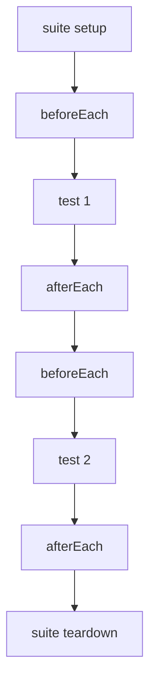

# 6. Setup & teardown

When several tests need the same starting state, you don't repeat it in each — you use **lifecycle hooks**
that run automatically before/after tests. This keeps tests focused on what's unique about them.

## The hooks

| Hook | Runs | Use for |
|---|---|---|
| `@beforeEach` | before **every** test in the group | Fresh fixtures per test |
| `@afterEach` | after **every** test in the group | Cleanup per test |
| Suite setup | once, before the suite's tests | Expensive one-time prep |
| Suite teardown | once, after the suite's tests | One-time cleanup |



## `@beforeEach` / `@afterEach`

Store shared state on `m` (your suite instance) in `@beforeEach`; every test then reads it from `m`.

```brightscript
namespace tests
  @suite("cart")
  class CartTests extends rooibos.BaseTestSuite

    @describe("totals")

    @beforeEach
    function _()
      ' fresh cart for each test — no leakage between tests
      m.cart = newCart()
      m.cart.add({ sku: "A", price: 100 })
      m.cart.add({ sku: "B", price: 50 })
    end function

    @afterEach
    function _()
      m.cart = invalid
    end function

    @it("sums line items")
    function _()
      m.assertEqual(m.cart.subtotal(), 150)
    end function

    @it("applies a percentage discount")
    function _()
      m.cart.applyDiscount(0.10)
      m.assertEqual(m.cart.subtotal(), 135)
    end function

  end class
end namespace
```

Because `@beforeEach` rebuilds `m.cart` for every test, the discount applied in the second test can't
affect the first. **Fresh state per test** is what makes tests independent and reliable.

## Why "each" matters: test isolation

A cardinal rule: **tests must not depend on each other or on run order.** If test B only passes because
test A ran first, you have a fragile suite. `@beforeEach` gives each test a clean slate so this can't happen.
Prefer `@beforeEach` over one-time setup unless the setup is genuinely expensive and read-only.

## Suite-level setup/teardown

For state that's costly to build and safe to share read-only across tests, use suite-level setup instead of
rebuilding per test. In Rooibos you provide setup/teardown functions and reference them from the suite. If
you're just starting, stick with `@beforeEach`/`@afterEach` — they cover the vast majority of cases and are
the safest default.

::: tip Keep hooks small
If a `@beforeEach` grows large or branches per test, that's a sign the tests want splitting into separate
groups, each with its own simpler setup.
:::

## What `m` holds

Anything you assign to `m` in a hook is available in the tests (and later hooks) of that run:

```brightscript
@beforeEach
function _()
  m.now = 1700000000        ' a fixed timestamp used by several tests
  m.user = { id: 1, name: "Ada" }
end function
```

This is also how you inject **fakes** for dependencies — covered next in
[Mocks, stubs & spies](/writing-tests/test-doubles).
